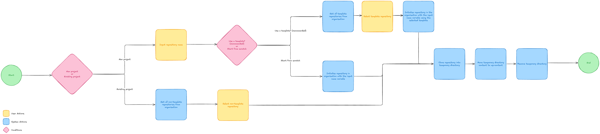

# Overview

This package makes it easy to sync a LocalWP site with your organisation's Git.

## Requirements

-   [GitHub CLI](https://cli.github.com/)
-   [SSH key linked to your GitHub account](https://docs.github.com/en/authentication/connecting-to-github-with-ssh/adding-a-new-ssh-key-to-your-github-account?tool=webui)

## Todo

-   Refactor build process to use webpack for transpilation & module bundling
-   Refactor the file copy function from `__temp__`. Right now it's blocking the main thread at O(N) runtime but I can use `fs/promises` and resolve them in parallel
